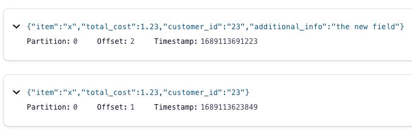
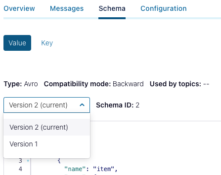

# Confluent Schema Registry

Start up the components:

```bash
docker-compose up -d
```

## Component Check

### Zookeeper

Let's check the Zookeeper Shell on the Zookeeper host:

```bash
docker-compose exec zookeeper zookeeper-shell localhost:2181
```

```bash
get /controller
{"version":2,"brokerid":1,"timestamp":"1689018188126","kraftControllerEpoch":-1}
```

### ReST Proxy

```bash
curl -s -XGET localhost:8082/v3/clusters | jq
```

```bash
curl -s -XGET localhost:8082/topics | jq

```

### Schema Registry

```bash
curl -s -XGET http://localhost:8081/schemas/types | jq
```

## Test the Application

Let's run V1 of our application:

```bash
cd confluent-schema-registry-v1
./gradlew clean
./gradlew generateAvroJava
./gradlew run    
```

Now let's run V2 of our application:

```bash
cd ../confluent-schema-registry-v2
./gradlew clean
./gradlew generateAvroJava
./gradlew run
```

If we're viewing the topic in C3 (http://localhost:9021/), we should see both versions of the message in our `avro-application-test-topic`:



And if you go to the Schema tab, you should see the two versions of the Schema:


